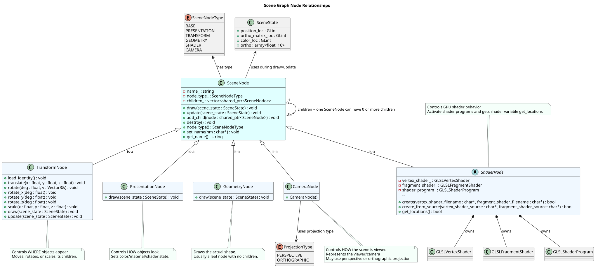
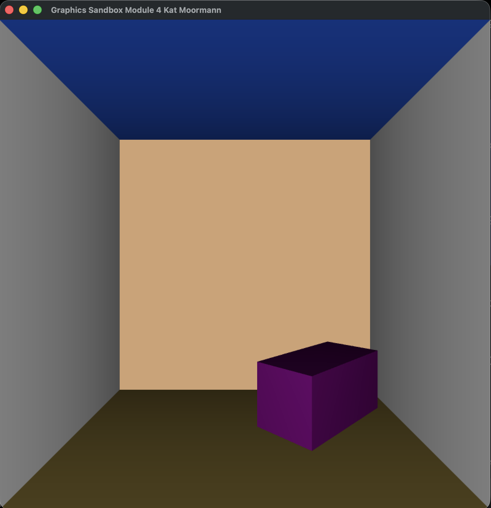
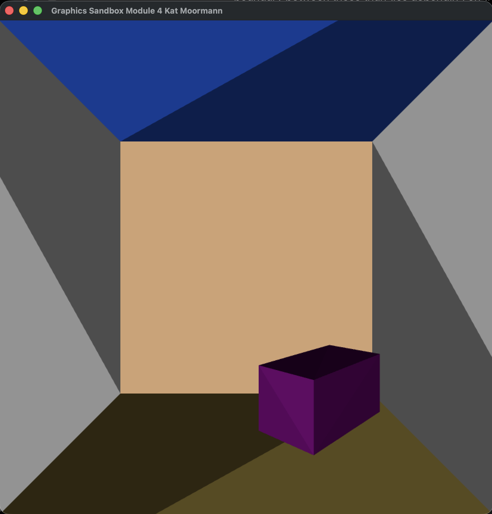
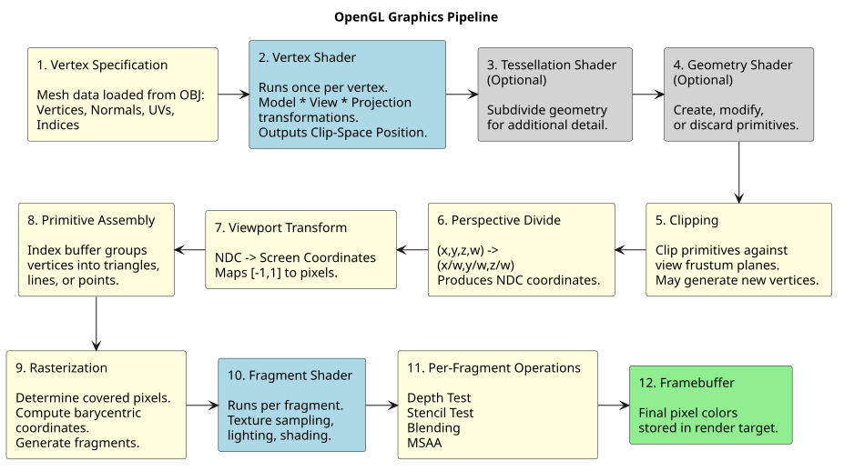
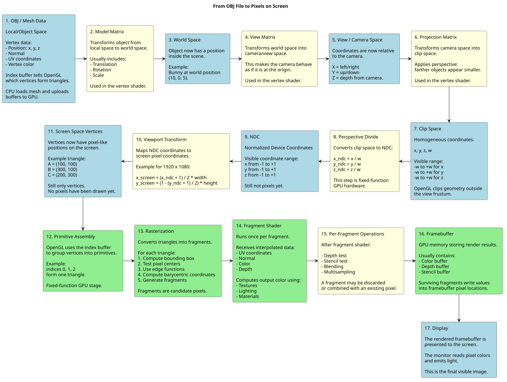

# graphics-sandbox

A sandbox for learning OpenGL, experimenting with rendering techniques, and building interactive 3D scenes.

## Scene Graph Relationships



## Module 2
OpenGL shader program to draw points or lines based on mouse clicks

## Module 3
OpenGL Scene Graph application rendering transparent polygons

## Module 4
OpenGL Scene Graph application demonstrating 3D transformations, lighting, back-face culling, gouraud shading, and depth testing 

From the vertex shader
```
// Gouraud Shading - calculating the lighting at each vertex
    color = vec4(material_color * max(dot(L,N), 0.0), 1.0);
```

### Flat vs. Gouraud Shading

The original scene uses **Gouraud shading**, where lighting is calculated at each vertex and the resulting colors are smoothly interpolated across the triangle.

For comparison, **flat shading** was enabled using GLSL's `flat` interpolation qualifier. With `flat`, the color calculated at the triangle's **provoking vertex** is used for every fragment in that triangle instead of being interpolated.

Because each rectangular surface in the scene is composed of **two triangles**, the two triangles can receive different lighting values even though they belong to the same planar face. This makes the underlying triangle geometry clearly visible.

- **Flat shading:** One constant lighting result per triangle.
- **Gouraud shading:** Lighting calculated per vertex, then colors are interpolated.
- **Phong shading:** Normals are interpolated and lighting is calculated per fragment.
  





## Downloaded Pieces

### SDL3

**SDL3** is a cross-platform library for creating windows, handling keyboard/mouse input, audio, controllers, and creating graphics contexts for OpenGL/Vulkan/Metal/etc. It officially supports Windows, macOS, Linux, iOS, and others.

### OpenGL

**OpenGL** is the graphics API we will use to talk to the GPU and render 2D/3D graphics. Khronos describes it as an API for high-performance graphics applications.</br></br>
*One thing I would like to mention - and this is why my next project will be developing in Vulkan and/or Metal because I would like to learn this process on a lower level. **macOS** supports OpenGL but Apple has deprecated it, and modern macOS generally caps OpenGL support around older versions.*

### GLEW

**GLEW** is an OpenGL extension loader. It helps expose OpenGL functions/extensions consistently across platforms.

## Installs

I am developing on my Mac for these initial set up processes:</br>
`brew install cmake sdl3 glew`

Verify your install:</br>
`brew list | grep -E "cmake|sdl3|glew`

Verify CMake: </br>
`cmake --version`

Verify SDL: </br>
`brew install pkgconf`</br>
`pkg-config --modversion sdl3`

## Setting up Scaffolding for my project

`mkdir src include shaders build`</br>
`touch src/main.cpp`</br>
`touch CMakeLists.txt`</br>

## OpenGL Pipeline Overview

1. **Vertex Specification**</b> This is where OpenGL receives the raw vertex data for an object. Vertex data usually includes positions, colors, normals, texture coordinates, and sometimes index data.</b>

2. **Vertex Shader**</b> The vertex shader runs once per every vertex. This is where transformations matter.

3. **Tessellation**</b>

4. **Geometry Shader**

5. **Vertex Post-Processing**

6. **Primitive Assembly**

7. **Rasterization**

8. **Fragment Shader**

9. **Per-Sample Operations**


## Graphics Pipeline Diagram



## Coordinate Space Journey of a Vertex



