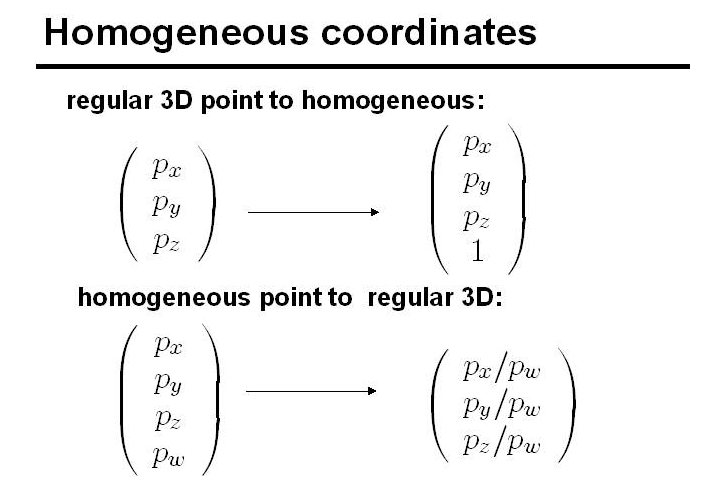
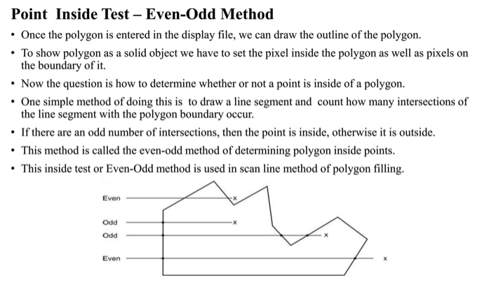

## 2D Homogenous point type: hpoint2
This header defines a 2D homogenous point type - a way to represent points in 2D space that makes graphics transformations much easier and more consistent.

The primary point of homogenous coordinates is to **unify all affine transformations (translation, rotation, scaling) and perspective projections into a single matrix multiplication.**



```cpp
struct HPoint2
{
    float x;
    float y;
    float w;
};
```

## Point3
3D point class called `Point3`

**Constructor from homogenous point**:</b>

`Point3::Point3(const HPoint3 &p) { *this = p.to_cartesian(); }`</br>
Converts a homogenous 3D point into a regular Cartesian 3D point</br>
A homogeneous point is usually: `(x, y, z, w)`</br>
To convert it: `(x/w, y/w, x/w)`</br>


### Affine Transformations

Affine transformation preserves straight lines and parallelism.

An affine combination is a weighted sum of points where the weights add up to 1.
For two points: `a0 + a1 = 1` and `result = a0 * P0 + a1 * P1`

### What is the Polygon Test?
The function:

`bool Point3::is_in_polygon(const std::vector<Point3> &polygon, const Vector3 &n) const`

tests whether this point is **inside a polygon**

The polygon is a list of 3D points: `std::vector<Point3> polygon`. The vector `n` is the polygon's normal vector. A normal vector is a vector perpendicular to the polygon's surface.

**Why does it use the normal vector?**</br>
A 3d polygon lies on some plane. Testing whether a point is inside a polygon is easier in 2D than in 3D. So the code projects the 3D polygon onto a 2D plane. 

It chooses which coordinate to drop based on the largest component of the normal vector: 
```C++
if(std::abs(n.x) >= std::abs(n.y) && std::abs(n.x) >= std::abs(n.z))
    return is_in_polygon_YZ(polygon); // Drop x
else if(std::abs(n.y) >= std::abs(n.x) && std::abs(n.y) >= std::abs(n.z))
    return is_in_polygon_XZ(polygon); // Drop y
else
    return is_in_polygon_XY(polygon); // Drop z
```

Meaning: 
- If the polygon mostly faces the `x`-direction, drop `x` and test in the `YZ` plane
- It the polygon mostly faces the `y`-direction, drop `y` and test in the `XZ` plane
- otherwise, drop `z` and test in the `XY` plane

**The Idea**
1. Start from a test point
2. Shoot a ray outward in one direction
3. Count how many polygon edges the ray crosses
4. If crossings are odd, the point is inside
5. If the crossings are even, the point is outside

